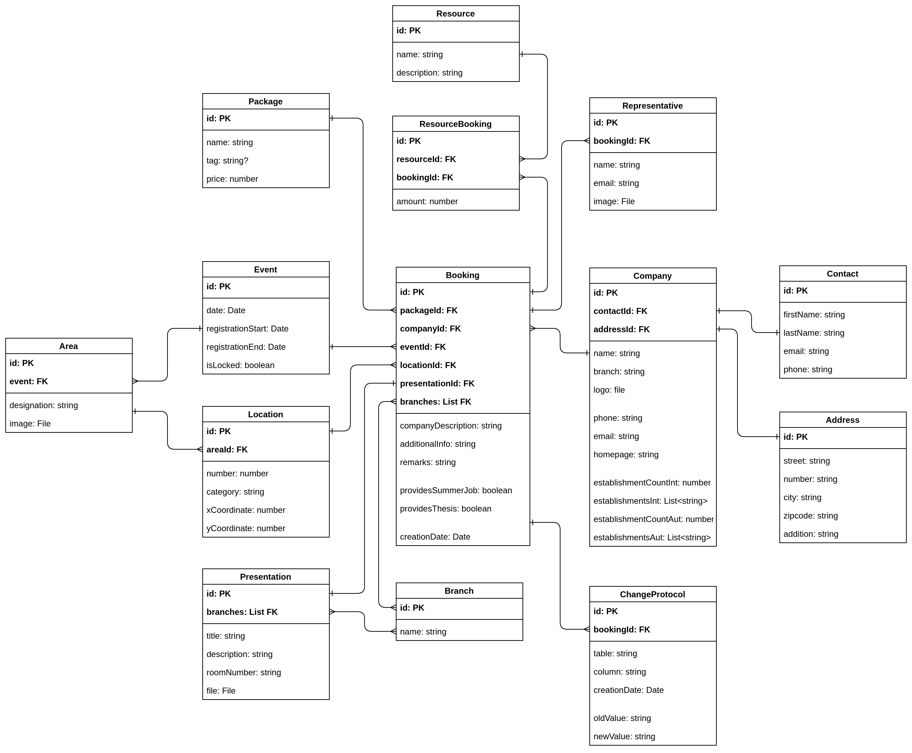

# FIT-Anmeldesystem-Backend


<br>


## Developer and Technical advice

### Branches and Developer:

- <b>Andrej Sakal:</b> Sakal-Dev
- <b>Felix Hofmann:</b> Hofmann-Dev

### API and Swagger:

- [http://localhost:8080/api/{controller}](http://localhost:8080/api/{controller})
- [http://localhost:8080/swagger](http://localhost:8080/swagger)

### Example Booking-Json
```
{
"fK_Event": 1,
"event": {
"eventDate": "2017-11-30T00:00:00",
"registrationStart": "2017-11-01T00:00:00",
"registrationEnd": "2018-11-30T00:00:00",
"isLocked": true,
"id": 1,
"timestamp": "AAAAAAAAB9Y="
},
"company": {
"name": "Sakal IT",
"address": null,
"fK_Address": 1,
"contact": null,
"fK_Contact": 1,
"phoneNumber": "+4369917202927",
"email": "andi.sakal15@gmail.com",
"homepage": "www.sakal-it.at",
"logoUrl": "www.sakal-it.at/logo",
"subjectAreas": "Informatik",
"id": 1,
"timestamp": "AAAAAAAAB9Q="
},
"fK_Company": 1,
"location": {
"number": 100,
"area": null,
"fK_Area": 1,
"category": "Iagenda Category",
"xCoordinate": 50,
"yCoordinate": 50,
"id": 1,
"timestamp": "AAAAAAAAB9k="
},
"fK_Location": 1,
"presentation": {
"branches": null,
"fK_Branch": 1,
"roomNumber": "252",
"title": "Presentations Title",
"description": "Presentationsbeschreibung",
"isAccepted": false,
"fileURL": "www.fileurl.com",
"id": 1,
"timestamp": "AAAAAAAAB9o="
},
"fK_Presentation": 1,
"branches": [],
"fK_Branches": 1,
"isAccepted": false,
"package": {
"name": "Premium Package",
"tag": "PP",
"number": 1,
"id": 1,
"timestamp": "AAAAAAAAB9U="
},
"fK_Package": 1,
"companyDescription": "Sakal Company",
"additionalInfo": "Additional Infos need sth",
"remarks": "bemerkungen",
"providesSummerJob": true,
"providesThesis": true,
"creationDate": "2017-11-05T00:00:00",
"id": 1,
"timestamp": "AAAAAAAAB9s="
}
```

### Microsoft SQL - Database in Docker

#### How to?

1. Download & Install Docker from Official Page
2. Set up 4GB RAM for Docker <b><u>important!!</u></b>
3. Check with "docker --version"
4. Pull Image with "docker pull microsoft/mssql-server-linux"
5. To run the container image with Docker, you can use the following command

###### 1. Linux/Mac <br>

docker run -e 'ACCEPT_EULA=Y' -e 'MSSQL_SA_PASSWORD=MyComplexPassword!234'  -p 1433:1433 -d microsoft/mssql-server-linux

###### 2. Windows PowerShell <br>

docker run -e "ACCEPT_EULA=Y" -e "MSSQL_SA_PASSWORD=MyComplexPassword!234" -p 1433:1433 -d microsoft/mssql-server-linux

1. Check logs of the run with "docker logs + first 3 numbers of hash""
2. If finished connect to Database with <br><b>localhost:1433</b> <br><b>Database: Backend<br><b>User: sa <br>Password: MyComplexPassword!234

<a href="https://docs.microsoft.com/en-us/sql/linux/quickstart-install-connect-docker">-> Help</a>


## Technologies


## Documents


<a href="https://www.dropbox.com/s/dvcypwakozlgwse/FITLOG_Pflichtenheft.docx?dl=0">Duty stapler</a>




